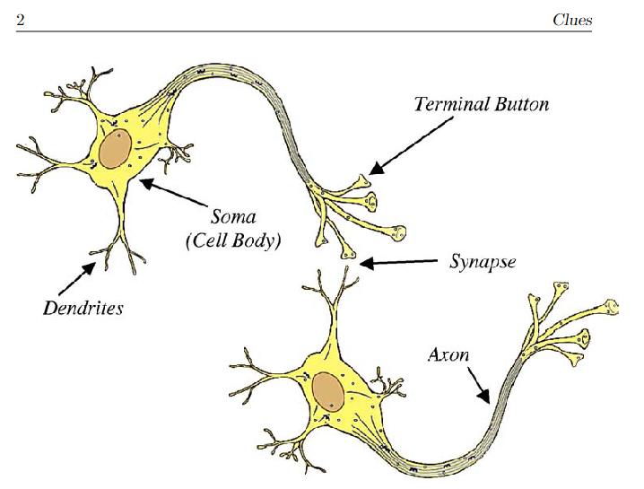
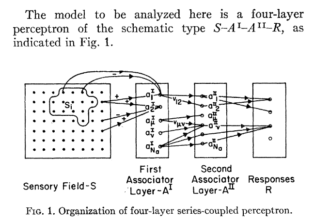
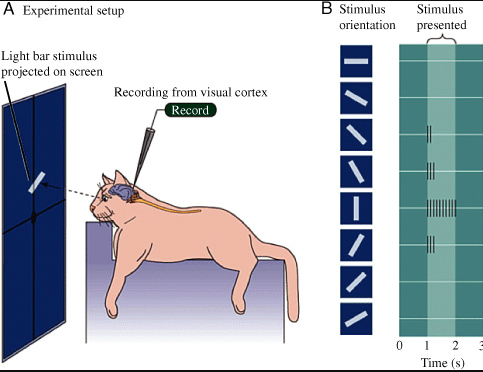

## Origem do Neurônio Natural
	- ((65f3b2b3-a705-4524-9f40-eea2ab43a075))
	- {:height 423, :width 440}
	-
- ## Neurônio artificial
	- Simular o comportamento do neurônio natural e suas conexões
		- ((65f9a01b-7f36-4960-8627-6bb9200add83))
	- ((65f99df8-ecb1-4f86-8cb2-0cc0ecc3a577))
	- ((65f99e2d-dfed-4821-98bc-fd0ed0857c6f))
	- ((65ee4ca1-0dc9-421c-bb93-2cb78f2d1eef))
- ## Perceptron
	- ((65ee5028-f46d-49ca-ac77-63f1f76a8712))
		- MCP = McCullough-Pitts
	- ((65f9cab4-d702-4e79-afdc-f5f3ca6e0711))
		- 
		- Fonte da imagem: 
- ## Conectando neurônios
	- Baseado no Neurônio de McCullough-Pitts
		- ((65f9c706-5006-434c-a772-c420c81b1b0e))
		- ((65f9c795-f629-4d49-b361-f0045c056aac))
- ## Neocognitron
  id:: 6601c698-517d-45c5-8c3e-45fc20f07141
	- Inspirado no  modelo de Hubel e Wiesel para processamento da visão, Fukushima  criou o **neocognitron** com objetivo de sanar:
		- ((6601d626-dd6a-41c8-8c62-64f660d236f9))
	- Simplificando a o modelo de Hubel e Wiesel:
		- Nós temos um conjunto de **células simples** responsável por identificar somente um estímulo (padrão) específico, por exemplo, para identificar uma barra na posição horizontal você tem uma célula para isso já para identificar a mesma barra na vertical você tem outra célula, com identificação quero dizer que a célula emite um sinal (neurônio é ativado)
		- Essas **células simples** passam a informações para **células complexas** que são ativadas independentemente da posição da barra, mas apenas pela presença da barra
		- ((6601ec1d-6764-4aa8-8b8b-85436638facd))
		- {:height 380, :width 483}
			- Fonte da imagem: [The Visual System and the Brain: Hubel and Wiesel Redux | The visual system: Hubel and Wiesel redux | InformIT](https://www.informit.com/articles/article.aspx?p=1431818)
		- O trabalho mais famoso com o uso do neocognitron é o Gradient-Based Learning Applied to Document Recognition ([Gradient-based learning applied to document recognition (hal.science)](https://hal.science/hal-03926082/document))
- Ler sobre a o desenvolvimento das redes convolucionais
- https://medium.com/appyhigh-technology-blog/convolutional-neural-networks-a-brief-history-of-their-evolution-ee3405568597